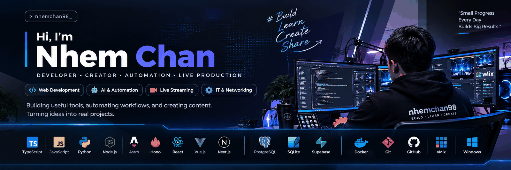

<div align="center">



<br>

# 👋 Hi, I'm Nhem Chan

### 💻 Developer · 🤖 AI & Automation · 🎥 Live Production · 🖥️ IT Support

**Building software, automating workflows, and keeping live systems running from Cambodia 🇰🇭**

<p>
<a href="https://github.com/nhemchan98">

</a>
<a href="mailto:nhem.chan.98@gmail.com">

</a>
<a href="https://nhemchan98.github.io">

</a>
</p>

</div>

---

## 🚀 About Me

I'm **Nhem Chan**, a technology-focused builder working across **software development, AI, IT support, and live production**.

- 💻 Build web applications, APIs, dashboards and automation tools
- 🤖 Explore AI, LLMs, Gemini and local AI with Ollama
- 🎥 Work with vMix, live streaming and multi-camera production
- 🖥️ Troubleshoot Windows, PCs, hardware, software and networking
- 🎬 Build tools for video and media workflows
- 🧩 Turn real-world problems into practical technical solutions
- 🇰🇭 Based in Cambodia

---

## 🧰 Tech Stack

### 💻 Development

<p>


</p>

### 🤖 AI & Automation

<p>


</p>

### 🎥 Live Production & IT

<p>


</p>

---

## ⭐ Featured Projects

<table>
<tr>
<td width="50%">

### 🤖 Telegram Research Bot
AI-assisted research and Telegram automation.

**Python · AI · Telegram**

</td>
<td width="50%">

### 🌦️ Weather Telegram Bot
Weather monitoring and automated notifications.

**TypeScript · Node.js · API**

</td>
</tr>
<tr>
<td>

### 🎬 MP4Box Splitter
Desktop video splitting workflow with a professional GUI.

**Python · PySide6 · MP4Box**

</td>
<td>

### 🏪 KNG Electronics
Business, inventory and web platform concept.

**Web · Database · API**

</td>
</tr>
</table>

<p align="center">
<a href="https://github.com/nhemchan98?tab=repositories">🔎 View all repositories →</a>
</p>

---

## 🎥 Live Production

### vMix · Streaming · Technical Operations

I work with live production systems where **stability, speed and troubleshooting** matter.

```text
🎥 vMix
 ├─ Live switching
 ├─ Multi-camera production
 ├─ Streaming / RTMP
 └─ Technical troubleshooting

🖥️ IT Support
 ├─ Windows
 ├─ PC / Hardware
 ├─ Networking
 └─ Software & system setup
```

> **Software should work. Live systems should keep working.**

---

## 🤖 AI Lab

I'm interested in practical AI that can actually save time.

```text
Gemini
 ├─ Research
 ├─ AI assistants
 └─ Automation

Ollama
 ├─ Local LLM
 ├─ Development
 └─ AI experiments

Telegram
 ├─ Research Bot
 ├─ Notifications
 └─ Automated workflows
```

---

## 📊 GitHub

<div align="center">


<br><br>


</div>

---

## 📈 Contribution Activity

<div align="center">


</div>

---

## 📫 Connect With Me

<p align="center">
<a href="https://github.com/nhemchan98">🐙 GitHub</a>
&nbsp; • &nbsp;
<a href="mailto:nhem.chan.98@gmail.com">📧 Email</a>
&nbsp; • &nbsp;
<a href="https://t.me/nhemchan">💬 Telegram</a>
&nbsp; • &nbsp;
<a href="https://nhemchan98.github.io">🌐 Portfolio</a>
</p>

---

<div align="center">

### ⚡ BUILD · LEARN · FIX · AUTOMATE

**Thanks for visiting my profile.**

</div>
